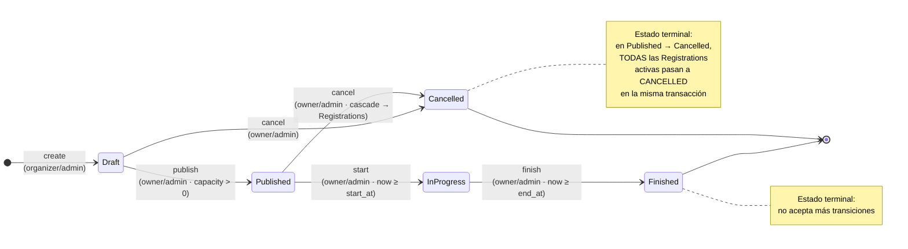
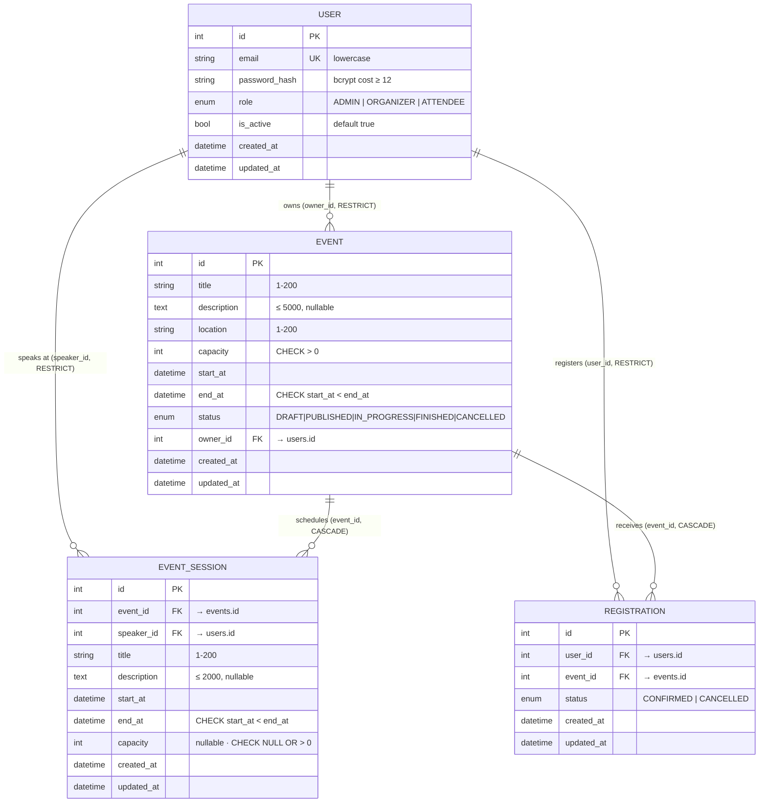

# Mis Eventos — MVP Full Stack

Aplicación web para digitalizar la gestión manual de eventos: inscripciones, sesiones, ponentes y asistentes. MVP funcional end-to-end con autenticación, RBAC, máquina de estados, agenda de sesiones.

## Quick-start (≤ 3 comandos)

Requisitos: Docker y Docker Compose.

```sh
cp .env.example .env
# Edita .env y rellena al menos: JWT_SECRET, SEED_ADMIN_EMAIL, SEED_ADMIN_PASSWORD
make up
```

Comprueba que todo arranca:

```sh
curl http://localhost:8000/health   # → {"status": "ok"}
open http://localhost:5173          # frontend
open http://localhost:8000/docs     # Swagger UI de la API
```

## Demo flow MVP

1. **Login del admin sembrado** en `/login` con `SEED_ADMIN_EMAIL` / `SEED_ADMIN_PASSWORD`.
2. **Registrar un Organizer** en `/register` y darle el rol `ORGANIZER` desde la DB (o usar el admin directo):
   ```sh
   docker compose exec db psql -U $POSTGRES_USER -d $POSTGRES_DB \
     -c "UPDATE users SET role='ORGANIZER' WHERE email='org@example.com';"
   ```
3. **Crear un evento Draft** desde `/events/new` (como organizer).
4. **Publicar el evento** con el botón "Publicar" en el detalle
5. **Añadir una sesión** con un ponente (otro usuario registrado) — el `SpeakerPicker` busca por email.
6. **Registrar un Asistente** en `/register` (rol por defecto `ATTENDEE`).
7. **Inscribirse al evento** desde el detalle público; el conteo (`confirmed_count / capacity`) sube.
8. **Cancelar la inscripción** y verificar que el botón vuelve a "Inscribirme".
9. **Como organizer**, transicionar el evento `Published → Cancelled`; todas las inscripciones activas pasan a `CANCELLED` en cascada transaccional.
10. Verifica el historial en `/me/registrations`.

## Smoke test de la API (con curl)

Útil si prefieres probar el backend sin pasar por el frontend. Requiere `jq` para extraer el token.

```sh
# 1. Login del admin sembrado
TOKEN=$(curl -s -X POST http://localhost:8000/api/v1/auth/login \
  -H "Content-Type: application/json" \
  -d '{"email":"admin@mieventos.local","password":"TuPasswordAdmin1"}' \
  | jq -r .access_token)

# 2. Perfil del actor
curl http://localhost:8000/api/v1/auth/me -H "Authorization: Bearer $TOKEN"

# 3. Crear evento Draft (admin actúa con permisos de organizer)
curl -X POST http://localhost:8000/api/v1/events \
  -H "Authorization: Bearer $TOKEN" \
  -H "Content-Type: application/json" \
  -d '{"title":"Demo","location":"Quito","capacity":50,
       "start_at":"2026-12-01T15:00:00Z","end_at":"2026-12-01T17:00:00Z"}'

# 4. Publicar (transición Draft → Published)
curl -X POST http://localhost:8000/api/v1/events/1/transition \
  -H "Authorization: Bearer $TOKEN" \
  -H "Content-Type: application/json" \
  -d '{"to_status":"PUBLISHED"}'

# 5. Listar eventos publicados (público, sin auth)
curl http://localhost:8000/api/v1/events

# 6. Inscribirse al evento
curl -X POST http://localhost:8000/api/v1/events/1/registrations \
  -H "Authorization: Bearer $TOKEN"
```

Todos los errores siguen el shape canónico `{ error: { code, message, details } }`. Ver el catálogo completo en [`.planning/error-catalog.md`](.planning/error-catalog.md).

## Stack

| Capa | Tecnología |
|---|---|
| Backend | Python 3.12 · FastAPI · SQLModel · SQLAlchemy 2.x · Alembic |
| DB | PostgreSQL 16 |
| Frontend | React 18 · TypeScript · Vite · React Router · Zustand · React Query · Axios |
| Tests | pytest + httpx (back) · Vitest + RTL (front) |
| Orquestación | Docker Compose |

## Flujo de autenticación

JWT con dos tokens emitidos por `POST /api/v1/auth/login`:

- **Access token** — TTL `15 min`, HS256. Va en `Authorization: Bearer <token>` en cada request protegida.
- **Refresh token** — TTL `7 días`, HS256. Se intercambia por un nuevo access vía `POST /api/v1/auth/refresh`.

**Frontend:** access token en memoria (Zustand store), refresh token en `localStorage` (fallback documentado — cookies `httpOnly` en backlog). El interceptor de Axios renueva el access **automáticamente** ante `AUTH_TOKEN_EXPIRED` y reintenta la request original **una sola vez**; si la renovación falla, hace logout.

**Seed admin:** si `SEED_ADMIN_EMAIL` y `SEED_ADMIN_PASSWORD` están en `.env`, se siembra al startup. Idempotente: si el usuario ya existe, no-op.

**Passwords:** `bcrypt` con cost ≥ 12. Política: mínimo 8 caracteres, ≥ 1 mayúscula, ≥ 1 dígito.

## Modelo de datos y estados

### Máquina de estados del evento

Transiciones controladas por RBAC y disparadas manualmente desde la UI. Todas las celdas no listadas → 409 `INVALID_TRANSITION`. Los estados `Finished` y `Cancelled` son terminales.




### MER — Modelo Entidad-Relación

4 entidades. El `speaker` **no es un rol global** sino un atributo derivado: un usuario es ponente de un evento si está asignado vía `EventSession.speaker_id`.


SS
> Detalle de entidades, atributos y reglas de negocio en [`.planning/domain.md`](.planning/domain.md).

## Estructura del repo

```
.
├── backend/                Backend FastAPI
│   ├── app/
│   │   ├── api/v1/         Routers (auth, events, sessions, registrations, users, me)
│   │   ├── core/           Config, errores, security, exception handlers
│   │   ├── db/             Engine, session helper (transactional), seed
│   │   ├── models/         SQLModel: User, Event, EventSession, Registration
│   │   ├── repositories/   Acceso a datos (sin lógica de negocio)
│   │   ├── schemas/        Pydantic in/out
│   │   ├── services/       Lógica de negocio + transacciones
│   │   └── tests/          pytest (131 tests · 98% coverage)
│   ├── alembic/            Migraciones en DB
│   └── README.md           Detalles backend
├── frontend/               Frontend React + Vite
│   ├── src/
│   │   ├── api/            Cliente axios + funciones por dominio
│   │   ├── components/     UI reusable + sesiones + eventos
│   │   ├── hooks/          React Query hooks
│   │   ├── lib/            Matriz espejo de transiciones (UX)
│   │   ├── pages/          Vistas (auth, events, sessions, registrations)
│   │   ├── stores/         Zustand (auth)
│   │   └── types/          Tipos compartidos
│   └── README.md           Detalles frontend
├── docker-compose.yml      Orquestación db + backend + frontend
├── makefile                Atajos (up, down, test, migrate, ...)
└── .env.example            Variables de entorno con placeholders
```

## Comandos make

| Comando | Acción |
|---|---|
| `make up` | Levanta el stack en background |
| `make down` | Detiene el stack (mantiene datos) |
| `make down-v` | Detiene y borra volúmenes (DB fresca) |
| `make migrate` | `alembic upgrade head` en el contenedor backend |
| `make logs` | Sigue logs de los 3 servicios |
| `make ps` | Estado de los servicios |
| `make sh-back` / `sh-front` | Shell dentro del contenedor |
| `make test` | Backend + frontend (con gates de cobertura) |
| `make test-back` | pytest --cov-fail-under=80 |
| `make test-front` | vitest --coverage (≥70%) |
| `make build` | Reconstruye imágenes sin levantar |

## Troubleshooting

- **`make up` falla con `JWT_SECRET no puede ser un placeholder`** → editaste `.env`? El secret debe tener ≥ 16 caracteres y no puede ser `changeme` / `secret` / `todo`.
- **Backend en restart loop** → `docker compose logs backend`. Típicamente DNS de Docker o DB no healthy. `make down-v && make up` reproduce el escenario limpio.
- **Frontend muestra "Error de red"** → verifica `VITE_API_BASE_URL` en `.env`. Por defecto debe apuntar a `http://localhost:8000/api/v1`.
- **Tests backend "Command not found: pytest"** → el `Dockerfile` instala con `--without dev`. El target `make test-back` ya hace `poetry install` antes; no corras `pytest` directo en el contenedor sin instalar dev deps.
- **`/me/registrations` retorna 401 tras 15 min** → el access token expiró. El frontend renueva automáticamente; con curl, vuelve a llamar a `/auth/login` o usa `/auth/refresh` con tu refresh token.
- **Migración no aplicó tras pull** → `make migrate` (o `make down && make up`; el entrypoint del backend corre `alembic upgrade head` al arrancar).

## Documentación

| Archivo | Contenido |
|---|---|
| [`CLAUDE.md`](CLAUDE.md) | Reglas globales (índice + 5 must-knows + mapa de la documentación). |
| [`.planning/domain.md`](.planning/domain.md) | Entidades, RBAC, máquina de estados, Regla de Oro. |
| [`.planning/api.md`](.planning/api.md) | Convenciones REST + endpoints del MVP. |
| [`.planning/error-catalog.md`](.planning/error-catalog.md) | Tabla canónica de los 16 códigos de error. |
| [`.planning/phases/0X-*.md`](.planning/phases/) | Spec denso por fase (Meta + Decisiones + Pasos + DoD). |
| [`.planning/decisions/00X-*.md`](.planning/decisions/) | ADRs: el porqué de las decisiones difíciles. |
| [`.planning/backlog.md`](.planning/backlog.md) | Post-MVP explícito con justificación. |
| [`backend/README.md`](backend/README.md) · [`frontend/README.md`](frontend/README.md) | Setup operativo por capa. |

## Backlog post-MVP

Detalle completo en [`.planning/backlog.md`](.planning/backlog.md). Los principales ítems documentados como deuda explícita:

- **Rate-limit `slowapi`** en `/auth/*` (requiere Redis para producción distribuida). Ver [ADR-005](.planning/decisions/005-phase-6-scope-cuts.md).
- **Logging JSON estructurado** (`python-json-logger`) + middleware `X-Request-ID`. Ver [ADR-005](.planning/decisions/005-phase-6-scope-cuts.md).
- **Test de concurrencia con Postgres real** en CI (SQLite no soporta `SELECT FOR UPDATE`). Ver [ADR-004](.planning/decisions/004-sqlite-vs-postgres-locks.md).
- **Profile admin**: `PATCH /users/{id}/status` y `PATCH /users/{id}/role`.
- **Lista de espera** (`Registration.status = Waitlist` + promoción FIFO al cancelar).
- **Refresh tokens en cookies `httpOnly`** server-side.
- **Logout server-side** (blacklist de tokens).
- **CI/CD pipeline** (GitHub Actions: lint + test + build).
- **E2E tests con Playwright**.

Cobertura: backend **98%** · frontend **85.6%** (líneas).

Tests: **131** backend · **50** frontend.
